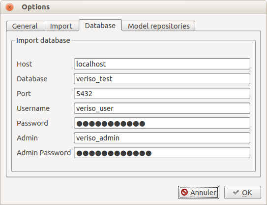

Architektur
===========
Die Organisation der Daten und Prüfungen und das Aussehen/GUI unterscheiden sich zu der ersten Version von VeriSO relativ stark. Gleich geblieben ist das  Vorgehen beim Prüfen der Daten:

1. Import der Interlis-Datei
2. Auswahl des zu prüfenden Operates
3. Durchführung der Tests, inkl. Absetzen der Mängelpunkte
4. Export der Mängelpunkte

Grundsätzliche Änderungen im Vergleich zu Version 1 werden in den folgenden Kapitel erläutert.

Fachschalen
-----------
Es wurde versucht das Plugin möglichst modular aufzubauen. Dh. der Importprozess (Export noch nicht implementiert), die Einstellungen und die Projekteverwaltung sind in einem Basismodul enthalten. Dazu können beliebige Fachschalen mit beliebigen Funktionen zusätzlich programmiert werden. So können neben verschiedenen Prüf-Fachschalen ebenso Fachschalen zur Erfassung von Daten erstellt werden. 

Im Filesystem ist das wie folgt organisiert:

   Organisation im Filesystem #1

Der Ordner ``base/`` enthält die Funktionen für den Import, die Einstellungen und die Projekteverwaltung:

   Organisation im Filesystem #2

Die Fachschalen sind im Ordner ``modules/`` organisiert:

.. figure::  images/organisation_veriso_filesystem3.png
   :align:   center

   Organisation im Filesystem #3

Jede Fachschale muss mindestens die Datei ``applicationmodule.py`` aufweisen:

   Organisation im Filesystem #4

Trennung von Datenmodell und Faschalen
--------------------------------------
Es ist jetzt möglich die identischen Prüfungen/Funktionen (unter gewissen Voraussetzungen) mit verschiedenen Datenmodellen durchzuführen. Dabei werden der Fachschale verschiedene Modelle zugewiesen. Diese Logik wird in der Datei ``modules/modules.json`` verwaltet:

::

    {
        "modules": [
            {
                "dirname": "veriso_ee",
                "displayname": "VeriSO (EE/EN)",    
                "ilimodels": [
                   {
                      "ilimodel": "DM01AVCH24D", 
                      "referenceframe": "LV03",            
                      "epsg": "21781"
                   },{
                      "ilimodel": "DM01AVCH24LV95D", 
                      "referenceframe": "LV95",            
                      "epsg": "2056"
                   },
                   {
                      "ilimodel": "DM01AVBE11D", 
                      "referenceframe": "LV03",            
                      "epsg": "21781"
                   },
                   {
                      "ilimodel": "DM01AVBE11LV95D", 
                      "referenceframe": "LV95",            
                      "epsg": "2056"
                   }
                ]
            },
            {
                "dirname": "veriso_dm01",
                "displayname": "VeriSO (DM.01)",
                "ilimodels": [
                   {
                      "ilimodel": "DM01AVCH24LV95D", 
                      "referenceframe": "LV95",            
                      "epsg": "2056"
                   },
                   {
                      "ilimodel": "DM01AVCH24D", 
                      "referenceframe": "LV03",            
                      "epsg": "21781"
                   },
                   {
                      "ilimodel": "DM01AVSO24", 
                      "referenceframe": "LV03",            
                      "epsg": "21781"
                   }
                ]
            }
        ]
    }

Im diesem Beispiel sind zwei Fachschalen vorhanden: *VeriSO (EE/EN)* und *VeriSO (DM.01)*. Die Attribute haben folgende Bedeutung:

* *dirname*: Name des Verzeichnisses der Fachschale im Filesystem.
* *displayname*: Name der Fachschale, wie sie im GUI erscheint.
* *ilimodels*: Die zur Fachschalen passenden Interlismodelle.

Für jedes Interlismodell müssen Informationen mitgeliefert werden:

* *ilimodel*: Name des Interlismodells.
* *referenceframe*: Referenzrahmen (LV03 oder LV95)
* *epsg*: EPSG-Code (21781 oder 2056)

Das Plugin resp. die Python Json-Funktion sind heikel was die Gültigkeit der Json-Datei betrifft. Am besten prüft man nach Änderungen die Json-Datei mit einem Online-Prüftool, z.B.: http://jsonformatter.curiousconcept.com/

Durch die Trennung von Datenmodell und Fachschale können jetzt die gleichen Prüfungen für verschiedene Datenmodelle durchgeführt werden. So müssen die Prüfungen nicht einmal für das kantonale Modell und z.B. für das Bundesmodell geschrieben werden. Voraussetzung ist aber, dass nichts geprüft wird, was in einem anderen Modell nicht vorkommt. Und es müssen unter Umständen die Abfragen oder die Legenden generisch(er) geschrieben werden. Der Kanton Solothurn kennt z.B. einige Erweiterungen der Bodenbedeckungsarten (die im Bundesmodell so nicht vorkommen). Eine WHERE-Bedingung zum Anzeigen sämtlicher *uebrige_befestigte* Objekte der Bodenbedeckung muss nun so aussehen:

::

    "art" LIKE 'uebrige_befestigte%'

So werden auch sämtliche kantonale Erweiterungen aus der Datenbank gelesen. Für das Bundesmodell alleine hätte diese Bedingung gereicht:

::

    "art" = 'uebrige_befestigte'

.. note:: *VeriSO (EE/EN)* und *VeriSO (DM.01)* sind beides Fachschalen zur Verifikation von Daten der amtlichen Vermessung. Die erste Variante legt den Fokus auf eine gesamtheitliche Verifikation der Daten (z.B. Verifikation der Bodenbedeckung, der Liegenschaften etc.). Die zweite Variante (*VeriSO (DM.01)*) dient zur Verifikation der im AV-Datenmodell DM.01 neu hinzugekommenen Topics (v.a. Gebäudeadressen). Eine weitere verwendete Fachschale ist *PNF-Homog.* (nicht aufgelistet), die in erster Linie zum Feststellen der Widersprüche zwischen AV-Datensatz und Realität (Orthofoto) dient und für die Periodische Nachführung und PNF verwendet wird. Mit diesem Ansatz können jetzt verschiedenste Fachschalen für verschiedenste Themenbereiche und Arbeitsschritte programmiert werden. Die Fachschalen teilen sich mindestens den Importprozess, die Einstellungen und die Projekteverwaltung.

Bezugsrahmen
------------
Es kann jedes beliebige Koordinatensystem (mit einem EPSG-Code) einem Modell zugewiesen werden, da jedes importierte Operat in einem separaten Datenbankschema verwaltet wird (siehe auch :ref:`import` und :ref:`datenhaltung`). Drittdaten (als Hintergrund oder Referenzdaten), die via WMS beim Prüfprozess dazu geladen werden, werden im richtigen Koordinatensystem angefordert. Der WMS-Server **muss** dieses Koordinatensystem unterstützen. Drittdaten, die aus einer Datenbank oder als Raster geladen werden, müssen gesondert betrachtet werden. Eventuell kann der Tabellenname oder Dateiname mit dem EPSG-Code ergänzt werden und die Fallunterscheidung kann so gemacht werden.

Mehrsprachigkeit
----------------
Die Möglichkeit der Mehrsprachigkeit wird ausgiebig im Kapitel :ref:`mehrsprachigkeit` erläutert.

.. _projekteverwaltung:

Projekteverwaltung(sdatenbank)
------------------------------
Die Verwaltung der importierten Operate wird in einer Sqlite-Datenbank gemacht. Dabei handelt es sich um eine Tabelle mit einer Vielzahl von Attributen:

   Projekteverwaltung

Diese Sqlite-Datenbank kann im VeriSO-Plugin unter *Settings - Options - General* ausgewählt werden. Falls keine Sqlite-Datenbank ausgewählt ist (z.B. beim allerersten Import), wird eine leere Datenbank aus dem ``templates/``-Ordner in das Projektewurzel-Verzeichnis (siehe auch :ref:`import`) kopiert. Normalerweise muss die Datenbank nicht verändert oder manuell nachgeführt werden. Mit einer passenden Software (z.B. Sqliteman) ist dies aber möglich.

.. _import:

Import
------
Einstellungen
*************
Einige Parameter für den Importprozess müssen in den *Settings - Options* vorgängig eingestellt werden:

   Optionen #1

Jeder Importprozess erstellt ein Projekteverzeichnis, in das später Datenexporte etc. gespeichert werden. Aus diesem Grund **muss** ein Projektwurzel-Verzeichnis angegeben werden. Eine weitere Einstellung ist die Wahl des Projekteverwaltungsdatenbank. In dieser werden sämtliche importierten Operate verwaltet (siehe :ref:`projekteverwaltung`).

.. figure::  images/options2.png
   :align:   center

   Optionen #2

Diese Einstellungen sind für den eigentlichen Importprozess. Es muss die ausführbare Jar-Datei ausgewählt werden und allfällige Parameter für die JVM angegeben werden. 

   Optionen #3

Hier werden die Datenbankparameter für die Datenhaltung eingetragen. 

   Optionen #4

Diese Einstellungen sind zur Zeit ohne Funktion. Sie zeigen nur die beiden Interlis Repositories in denen nach den Interlis-Modellen gesucht wird. Es können keine neuen Repositories hinzugefügt werden.

.. note:: Das Projektewurzel-Verzeichnis und die Datenbankparameter können **jederzeit** geändert werden ohne dass man den Zugriff auf bereits importierte Operate verliert. Diese Parameter werden in der Projekteverwaltungsdatenbank mitgespeichert und werden falls benötigt aus dieser Datebank gelesen.

Importprozess
*************
Beim Importprozess stehen die in der Datei ``modules/modules.json`` eingetragenen Fachschalen und Modelle zur Verfügung:

   Importprozess

Der *Check*-Button prüft mit einer Abfrage in der Geodatenbank, ob das Schema bereits vorhanden ist. Es wird bewusst *nicht* die Projekteverwaltungsdatenbank abgefragt, da unter Umständen gewisse Benutzer nicht alle Projekte "sehen" dürfen und eine angepasste Projekteverwaltungsdatenbank verwenden.

Aufgrund des Systembruches (Python <-> Java) ist die Suche nach Fehlern beim Import erschwert. Nach dem Import (mit Java) sucht das (Python)-Plugin im Output-Fenster nach den Wörtern "ERROR", "FATAL" etc. um Fehler zu finden. Ist das Fenster komplett leer, wird ebenfalls von einem Fehler ausgegangen. **Vor** dieser Fehlersuche wird die Projekteverwaltungsdatenbank nachgeführt. Sollte beim Import ein Fehler aufgetreten sein, kann trotzdem das Datenbankschema via *File - Delete project* gelöscht werden. Ansonsten müsste man das manuell in pgadmin3 erledigen.

Die Datenbankparameter werden vom Python-Plugin in eine temporäre Properties-Datei (im ``/tmp/``-Verzeichnis) geschrieben, die dem Java-Importprozess als Parameter übergeben wird. Die Datei liegt im ``/tmp/``-Verzeichnis und endet auf *.properties. Der Name der Datei entspricht einer Zufahlszahl.

.. note:: Das Interlismodell wird direkt aus dem ITF gelesen und **nicht** aus der ``modules.json`` Datei. 

.. _datenhaltung:

Datenhaltung
------------
Vorbereitung
************
Es muss einmalig (resp. für jede "Benutzerorganisation") eine Datenbank angelegt werden:

.. code-block:: bash

   #!/bin/bash

   ADMIN="veriso_admin"
   ADMINPWD="veriso_admin"
   USER="veriso_user"
   USERPWD="veriso_user"

   DB_NAME="veriso_test"
   PG_VERSION="9.3"
   POSTGIS_VERSION="postgis-2.1"

   # Auskommentieren falls man z.B. nur DB neu anlegen will.
   echo "Create database user"
   sudo -u postgres psql -d postgres -c "CREATE ROLE $ADMIN CREATEDB LOGIN PASSWORD '$ADMINPWD';"
   sudo -u postgres psql -d postgres -c "CREATE ROLE $USER LOGIN PASSWORD '$USERPWD';"

   echo "Create database: $DB_NAME"
   sudo -u postgres createdb --owner $ADMIN $DB_NAME
   sudo -u postgres psql -d $DB_NAME -c "ALTER SCHEMA public OWNER TO $ADMIN;"

   echo "Load postgis"
   sudo -u postgres psql -d $DB_NAME -f /usr/share/postgresql/$PG_VERSION/contrib/$POSTGIS_VERSION/postgis.sql
   sudo -u postgres psql -d $DB_NAME -f /usr/share/postgresql/$PG_VERSION/contrib/$POSTGIS_VERSION/postgis_comments.sql
   sudo -u postgres psql -d $DB_NAME -f /usr/share/postgresql/$PG_VERSION/contrib/$POSTGIS_VERSION/spatial_ref_sys.sql

   echo "Grant tables to..."
   sudo -u postgres psql -d $DB_NAME -c "GRANT ALL ON SCHEMA public TO $ADMIN;"
   sudo -u postgres psql -d $DB_NAME -c "ALTER TABLE geometry_columns OWNER TO $ADMIN;"   
   sudo -u postgres psql -d $DB_NAME -c "GRANT ALL ON geometry_columns TO $ADMIN;"
   sudo -u postgres psql -d $DB_NAME -c "GRANT ALL ON spatial_ref_sys TO $ADMIN;"
   sudo -u postgres psql -d $DB_NAME -c "GRANT ALL ON geography_columns TO $ADMIN;"

   sudo -u postgres psql -d $DB_NAME -c "GRANT SELECT ON geometry_columns TO $USER;"
   sudo -u postgres psql -d $DB_NAME -c "GRANT SELECT ON spatial_ref_sys TO $USER;"
   sudo -u postgres psql -d $DB_NAME -c "GRANT SELECT ON geography_columns TO $USER;"

Die hier gewählten Datenbankparameter sind im Plugin unter *Settings - Options - Database* einzutragen.

Datenbankschema
***************
Jedes zu prüfende Operat wird in einem seperaten Datenbankschema verwaltet. Der Importprozess generiert vor dem Importieren der Daten aus dem Interlismodell sämtliche SQL-Befehle (CREATE SCHEMA / TABLE etc.), speichert sie in einem *String* und erstellt anschliessend automatisch das Schema und die Tabellen. Zusätzlich werden sämtliche Enumerations-Code-Tabellen (z.B. Bodenbedeckungsarten) erstellt und abgefüllt.

.. _postprocessing:

Postprocessing
--------------
Um nicht bloss vorhanden Tabellen in QGIS anzeigen zu können, ist es möglich beliebige und beliebig komplexe SQL-Abfragen als View resp. als "Create -Table/Insert-into-Kombination" zu definieren. Diese SQL-Befehle werden während des Importprozesses *nach* nach dem Importieren der Daten abgesetzt.

Verwaltet werden diese Befehle in einer SQLite-Datenbank mit vier Tabellen:

1. *tables:* Tabellen erzeugen.
2. *views:* Views erzeugen.
3. *inserts:* SQL-Query, die in die vorher erzeugten Tabellen die Abfrageresultate schreibt.
4. *updates:* Tabellenupdates.

Die Auflistung entspricht der Reihenfolge der Ausführung. Für einfachere Abfragen können Views verwendet werden. Wenn die Performance mit Views nicht mehr reicht, sollten Tabellen erzeugt werden. Für ganz einfache Abfragen (WHERE-Bedingung) kann der "sql"-Parameter beim Laden der Layern in ComplexChecks (siehe Kapitel :ref:`complexchecks`) verwendet werden.

Ein Template diese SQLite-Datenbank befindet sich im Ordner ``templates/``. Sie muss umbenannt werden von ``template_postprocessing.db`` zu ``postprocessing.db`` und in den Ordner ``postprocessing/`` der jeweiligen Fachschale kopiert werden.

