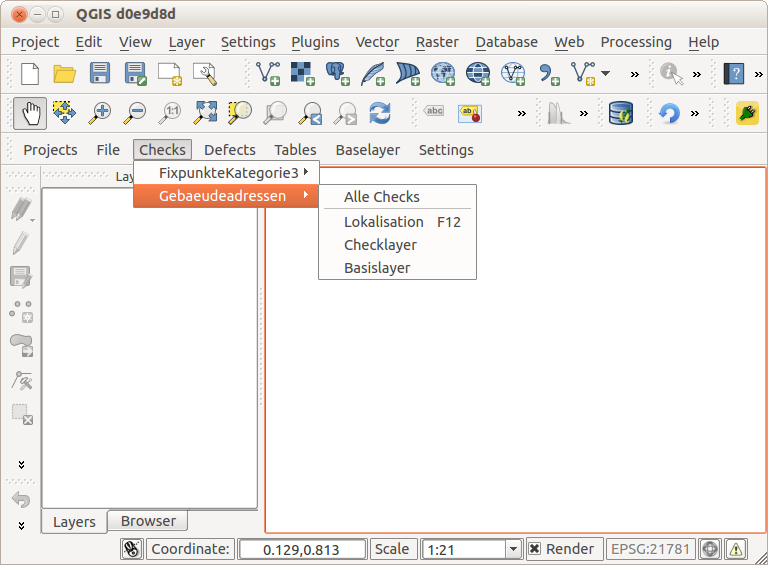
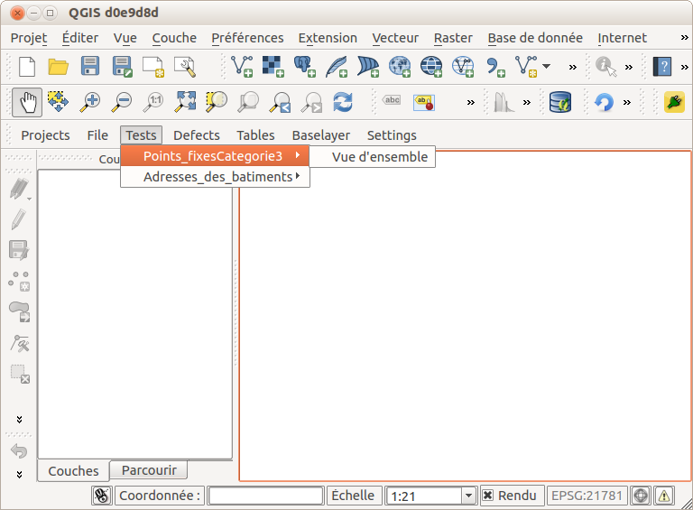

.. _complexchecks:

Complexchecks
=============
Bei *Complexchecks* handelt es sich um die eigentlichen Prüfungen/Checks, die vom Benutzer durchgeführt werden. Es ist somit eine Funktion, die einer Verifikationsfachschale zugeordnet werden kann. Es zeigt aber ebenfalls exemplarisch wie mit ähnlichen technischen Fragestellungen in anderen Fachschalen umgegangen werden kann.

Organisation
------------
Im ``modules/MEIN_MODUL``-Verzeichnis (hier ``veriso_ee``) sind zwei Ordner anzulegen: ``checks`` und ``complexchecks``. Im Ordner ``checks`` sind verschiedene JSON-Dateien. Eine JSON-Datei **muss** `checks.json` heissen. Der Inhalt dieser Datei beschreibt die Grundstruktur der verschiedenen Checks(-dateien):

::
 
 {  
   "checks":[  
      {  
         "topic":{  
            "de":"FixpunkteKategorie3",
            "fr":"Points_fixesCategorie3"
         },
         "file":"topic_fp3"
      },
      {  
         "topic":{  
            "de":"Gebaeudeadressen",
            "fr":"Adresses_des_batiments"
         },
         "file":"topic_gebaeudeadressen"
      }
   ]
 }

Dieses Beispiel führt zu folgendem Dropdown-Menu in QGIS:

.. figure::  images/checks_01.png
   :align:   center

   Checkmenu #1
   
Für jeden *topic*-Eintrag wird ein Menu-Eintrag in QGIS erstellt. Soll der Menueintrag mehrsprachig sein, dh. in der in QGIS jeweils eingestellten Sprache erscheinen, muss das Attribut *topic* aufgesplittet werden. Für jede Sprache muss ein Attribut mit *"Sprachkürzel"* = *"Topicname in der gewünschten Sprache"* gesetzt werden. Das Kürzel entspricht `ISO 639-1 <http://en.wikipedia.org/wiki/List_of_ISO_639-1_codes>`_.

Das Attribut *file* (Achtung: ohne .py-Extension) zeigt auf eine weitere JSON-Datei (z.B. topic_gebaeudeadressen.py), die ebenfalls im gleichen Verzeichnis vorhanden sein muss. Diese sie z.B. so aus:

::
 
 {
  "checks": [
    {
      "id": "alle_checks",
      "name": "Alle Checks", 
      "file": "complexchecks.gebaeudeadressen_alle_checks"
    }, 
    {
      "id": "separator",
      "name": "separator"
    },
    {
      "id": "gebaeudeadressen_lokalisation", 
      "name": "Lokalisation",
      "group": "Gebaeudeadressen", 
      "file": "complexchecks.gebaeudeadressen_lokalisation",
      "shortcut": "F12"
    },    
    {
      "id": "gebaeudeadressen_checklayer", 
      "name": "Checklayer",
      "group": "Gebaeudeadressen", 
      "file": "complexchecks.gebaeudeadressen_checklayer"
    },    
    {
      "id": "gebaeudeadressen_basislayer", 
      "name": "Basislayer",
      "group": "Gebaeudeadressen", 
      "file": "complexchecks.gebaeudeadressen_basislayer"
    }   
  ]
 }
 
Und führt zu folgendem Submenu:

   Checkmenu #2

Mit dem Attribut *name* = *separator* kann dem Menu ein Trennstrich hinzugefügt werden. Mit dem Attribut *shortcut* können Shortcuts definiert werden (siehe `Qt Dokumentation <http://qt-project.org/doc/qt-4.8/qaction.html#shortcut-prop>`_). Für jedes *group*-Attribut wird ein Submenueintrag erstellt. Das Attribut *file* zeigt auf die eigentliche Python-Klasse mit den Prüfungen. In diesem Beispiel liegen sie im Modulverzeichnis im Ordner ``complexchecks/``. Es darf keine .py-Extension beim Dateinamen angegeben werden.

Für mehrsprachige Menüeinträge muss in diesem Fall das Attribut *name* aufgeteilt und übersetzt werden, z.B.:

::

 {  
   "checks":[  
      {  
         "id":"fp3",
         "name":{  
            "de":"Übersicht",
            "fr":"Vue d'ensemble"
         },
         "file":"complexchecks.fp3"
      }
   ]
 }

Dies führt zu folgendem Submenueintrag:

   Checkmenu #3

.. note:: Es gibt für VeriSO keine separate Einstellung der Sprache sondern es wird die eingestellte Sprache von QGIS übernommen. Diese lässt sich unter *Settings* - *Options* - *Locale* ändern.

ComplexCheck
------------
Die Prüfklasse (ComplexCheck) muss **immer** *ComplexCheck* heissen und mindestens die Methode *run* aufweisen. Ansonsten kann sie beliebig komplex sein und beliebige andere Klassen/Methoden etc. einbinden und aufrufen.

Nachstehend ein einfachs Beispiel. Die Erläuterungen folgen anschliessend.

.. code-block:: python
   
 # -*- coding: utf-8 -*-
 from PyQt4.QtCore import *
 from PyQt4.QtGui import *
 from qgis.core import *
 from qgis.gui import *

 import sys
 import traceback

 from veriso.base.utils.doLoadLayer import LoadLayer

 try:
    _encoding = QApplication.UnicodeUTF8
    def _translate(context, text, disambig):
        return QApplication.translate(context, text, disambig, _encoding)
 except AttributeError:
    def _translate(context, text, disambig):
        return QApplication.translate(context, text, disambig)

 class ComplexCheck(QObject):
    def __init__(self, iface):
        self.iface = iface
        
        self.root = QgsProject.instance().layerTreeRoot()        
        self.layerLoader = LoadLayer(self.iface)

    def run(self):        
        self.settings = QSettings("CatAIS","VeriSO")
        project_id = self.settings.value("project/id")
        epsg = self.settings.value("project/epsg")
        
        locale = QSettings().value('locale/userLocale')[0:2] # Für Multilingual-Legenden.

        if not project_id:
            self.iface.messageBar().pushMessage("Error",  _translate("VeriSO_EE_FP3", "project_id not set", None), level=QgsMessageBar.CRITICAL, duration=5)                                
            return

        QApplication.setOverrideCursor(Qt.WaitCursor)
        try:
            group = _translate("VeriSO_EE_FP3", "FixpunkteKategorie3", None)
            group += " (" + str(project_id) + ")"
            
            layer = {}
            layer["type"] = "postgres"
            layer["title"] = _translate("VeriSO_EE_FP3", "Toleranzstufen", None) 
            layer["featuretype"] = "tseinteilung_toleranzstufe"
            layer["geom"] = "geometrie"
            layer["key"] = "ogc_fid"            
            layer["sql"] = ""
            layer["readonly"] = True
            layer["group"] = group
            layer["style"] = "tseinteilung/toleranzstufe_"+locale+".qml"
            
            vlayer = self.layerLoader.load(layer)
            
            layer = {}
            layer["type"] = "postgres"
            layer["title"] = _translate("VeriSO_EE_FP3", "LFP3 Nachführung", None)
            layer["featuretype"] = "fixpunktekategorie3_lfp3nachfuehrung"
            layer["geom"] = "perimeter" 
            layer["key"] = "ogc_fid"            
            layer["sql"] = ""
            layer["readonly"] = True            
            layer["group"] = group
            
            vlayer = self.layerLoader.load(layer, False, True)            
            
            layer = {}
            layer["type"] = "postgres"
            layer["title"] = _translate("VeriSO_EE_FP3", "LFP3", None)
            layer["featuretype"] = "fixpunktekategorie3_lfp3"
            layer["geom"] = "geometrie"
            layer["key"] = "ogc_fid"            
            layer["sql"] = ""
            layer["readonly"] = True            
            layer["group"] = group
            layer["style"] = "fixpunkte/lfp3.qml"

            vlayer = self.layerLoader.load(layer)
            
            layer = {}
            layer["type"] = "postgres"
            layer["title"] = _translate("VeriSO_EE_FP3", "LFP3 ausserhalb Gemeinde", None)
            layer["featuretype"] = "v_lfp3_ausserhalb_gemeinde"
            layer["geom"] = "geometrie"
            layer["key"] = "ogc_fid"            
            layer["sql"] = ""
            layer["readonly"] = True            
            layer["group"] = group
            layer["style"] = "fixpunkte/lfp3ausserhalb.qml"
            
            vlayer = self.layerLoader.load(layer)
            
            # So funktionieren WMS:
            layer = {}
            layer["type"] = "wms"
            layer["title"] = _translate("VeriSO_EE_FP3", "LFP1 + LFP2 Schweiz", None)
            layer["url"] = "http://wms.geo.admin.ch/"
            layer["layers"] = "ch.swisstopo.fixpunkte-lfp1,ch.swisstopo.fixpunkte-lfp2"
            layer["format"] = "image/png"          
            layer["crs"] = "EPSG:" + str(epsg)
            layer["group"] = group

            vlayer = self.layerLoader.load(layer, False, True)

            layer = {}
            layer["type"] = "postgres"
            layer["title"] = _translate("VeriSO_EE_FP3", "Gemeindegrenze", None)
            layer["featuretype"] = "gemeindegrenzen_gemeindegrenze"
            layer["geom"] = "geometrie"
            layer["key"] = "ogc_fid"            
            layer["sql"] = ""
            layer["readonly"] = True
            layer["group"] = group
            layer["style"] = "gemeindegrenze/gemgre_strichliert.qml"

            gemgrelayer = self.layerLoader.load(layer)

            # Kartenausschnit verändern. 
            # Bug (?) in QGIS: http://hub.qgis.org/issues/10980
            if gemgrelayer:
                rect = gemgrelayer.extent()
                rect.scale(5)
                self.iface.mapCanvas().setExtent(rect)        
                self.iface.mapCanvas().refresh() 
            # Bei gewissen Fragestellungen sicher sinnvoller
            # auf den ganzen Kartenausschnitt zu zoomen:
            # self.iface.mapCanvas().zoomToFullExtent()
            
                
        except Exception:
            QApplication.restoreOverrideCursor()            
            exc_type, exc_value, exc_traceback = sys.exc_info()
            self.iface.messageBar().pushMessage("Error", str(traceback.format_exc(exc_traceback)), level=QgsMessageBar.CRITICAL, duration=5)                    
        QApplication.restoreOverrideCursor()      

Hinweise und Erläuterungen zum Code:

.. code-block:: python
   
 # -*- coding: utf-8 -*-
 from PyQt4.QtCore import *
 from PyQt4.QtGui import *
 from qgis.core import *
 from qgis.gui import *

 import sys
 import traceback

 from veriso.base.utils.doLoadLayer import LoadLayer

 try:
    _encoding = QApplication.UnicodeUTF8
    def _translate(context, text, disambig):
        return QApplication.translate(context, text, disambig, _encoding)
 except AttributeError:
    def _translate(context, text, disambig):
        return QApplication.translate(context, text, disambig)

Zuerst werden allerlei Pythonmodule importiert und eine Methode (*_translate*) zur Übersetzung von Layernamen etc. definiert.

.. code-block:: python

 class ComplexCheck(QObject):
    def __init__(self, iface):
        self.iface = iface
        
        self.root = QgsProject.instance().layerTreeRoot()        
        self.layerLoader = LoadLayer(self.iface)

    def run(self):        
        self.settings = QSettings("CatAIS","VeriSO")
        project_id = self.settings.value("project/id")
        epsg = self.settings.value("project/epsg")
        
        locale = QSettings().value('locale/userLocale')[0:2] # Für Multilingual-Legenden.

        if not project_id:
            self.iface.messageBar().pushMessage("Error",  _translate("VeriSO_EE_FP3", "project_id not set", None), level=QgsMessageBar.CRITICAL, duration=5)                                
            return

Anschliessend wird die Klasse und die *run*-Methode definiert. *self.root* und *self.layerLoader* dienen zum Laden und Hinzufügen von Layern. Mit *locale* wird die in QGIS gewählte Sprache ausgelesen. 

.. code-block:: python

        QApplication.setOverrideCursor(Qt.WaitCursor)
        try:
            group = _translate("VeriSO_EE_FP3", "FixpunkteKategorie3", None)
            group += " (" + str(project_id) + ")"
            
            layer = {}
            layer["type"] = "postgres"
            layer["title"] = _translate("VeriSO_EE_FP3", "Toleranzstufen", None) 
            layer["featuretype"] = "tseinteilung_toleranzstufe"
            layer["geom"] = "geometrie"
            layer["key"] = "ogc_fid"            
            layer["sql"] = ""
            layer["readonly"] = True
            layer["group"] = group
            layer["style"] = "tseinteilung/toleranzstufe_"+locale+".qml"
            
            vlayer = self.layerLoader.load(layer)

Hier beginnt die eigentliche Prüfung resp. das Laden der Layer in QGIS. Zuerst wird der Namen der Legendengruppe (*group*) gesetzt. Im Gegensatz zu den Texten in den Menueinträgen, die in den JSON-Dateien direkt übersetzt werden, können die Gruppen- und Layernamen nicht direkt hier übersetzt werden sondern müssen zur Übersetzung zu einem späteren Schritt "gekennzeichnet" werden. Diese Kennzeichnung wird mit der vorher definierten Methoden *_translate()* gemacht. Der erste Parameter dieser Methode ist ein eindeutiger Name, dh. für jeden ComplexCheck sollte ein Name gewählt werden (Punkt innerhalb dieses Namen sind nicht erlaubt). Der zweite Parameter ist der eigentliche Text, der übesetzt werden soll. Der dritte Parameter ist immer "None").

Anschliessend wird ein *layer*-Objekt erstellt (Python dictionary). Für Datenbanktabellen müssen die oben definierten Einträge vorhanden sein. Falls der Eintrag *geom* fehlt und der Layer jedoch eine Geometrie aufweist als *geometryless*-Table geladen. 

Der Name des Layers wie er in der Legende erscheinen soll, muss/kann mit der *_translate()* Methode zur Übersetzung markiert werden.

Sind wegen der Mehrsprachigkeit verschiedene Legenden notwendig, kann diese mit der Variable *locale* gesteuert werden. Es sind dann verschieden QML-Dateien notwendig (jeweils mit der Endung "...._KÜRZEL.qml").

Anschliessend wird der Layer geladen. Die Methode self.layerLoader.load() hat insgesamt vier Parameter, wobei drei davon Defaultwerte besitzen und somit optional sind:

.. code-block:: python
   
    def load(self, layer, visible = True, collapsed_legend = False, collapsed_group = False):
       ....
       
Der erste Parameter (*visible*) ist standardmässig *True*. Der Layer wird somit eingeschaltet. Der zweite Parameter (*collapsed_legend*) ist standarmässig *False*, dh. die Legende des Layers ist sichtbar. Der letzte Parameter (*collapsed_group*) steuert die Gruppe. Standardmässig ist der Parameter *False*, dh. die Gruppe ist aufgeklappt.

WMS-Layer werden wie folgt geladen:

.. code-block:: python

            layer = {}
            layer["type"] = "wms"
            layer["title"] = _translate("VeriSO_EE_FP3", "LFP1 + LFP2 Schweiz", None)
            layer["url"] = "http://wms.geo.admin.ch/"
            layer["layers"] = "ch.swisstopo.fixpunkte-lfp1,ch.swisstopo.fixpunkte-lfp2"
            layer["format"] = "image/png"          
            layer["crs"] = "EPSG:" + str(epsg)
            layer["group"] = group

            vlayer = self.layerLoader.load(layer, False, True)

Mit folgendem Code wird die Karte zu guter Letzt neu zentriert:

.. code-block:: python

            if gemgrelayer:
                rect = gemgrelayer.extent()
                rect.scale(5)
                self.iface.mapCanvas().setExtent(rect)        
                self.iface.mapCanvas().refresh() 

Dabei wird in diesem Beispiel übertrieben stark herausgezoomt (*rect.scale(5)*).
