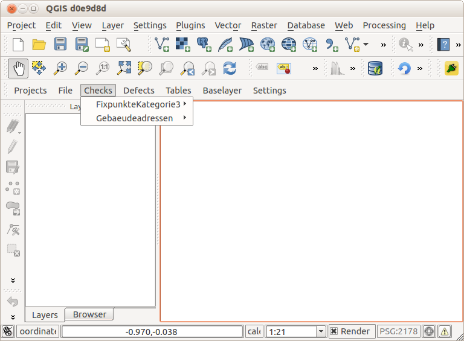

.. _complexchecks:

Complexchecks
=============
Bei *Complexchecks* handelt es sich um die eigentlichen Prüfungen/Checks, die vom Benutzer durchgeführt werden. Es ist somit eine Funktion, die einer Verifikationsfachschale zugeordnet werden kann. Es zeigt aber ebenfalls exemplarisch wie mit ähnlichen technischen Fragestellungen in anderen Fachschalen umgegangen werden kann.

Organisation
------------
Im ``modules/veriso_ee``-Verzeichnis sind zwei Ordner anzulegen: ``checks`` und ``complexchecks``. Im Ordner ``checks`` sind verschiedene JSON-Dateien. Eine JSON-Datei **muss** `checks.json` heissen. Der Inhalt dieser Datei beschreibt die Grundstruktur der verschiedenen Checks(-dateien):

::
 
 {  
   "checks":[  
      {  
         "topic":{  
            "de":"FixpunkteKategorie3",
            "fr":"Points_fixesCategorie3"
         },
         "file":"topic_fp3"
      },
      {  
         "topic":{  
            "de":"Gebaeudeadressen",
            "fr":"Adresses_des_batiments"
         },
         "file":"topic_gebaeudeadressen"
      }
   ]
 }

Dieses Beispiel führt zu folgendem Dropdown-Menu in QGIS:

   Checkmenu #1
   
Für jeden *topic*-Eintrag wird also ein Menu-Eintrag in QGIS erstellt. Erläuterung der Mehrsprachigkeit: siehe :ref:`mehrsprachigkeit`. 

Das Attribut *file* zeigt auf eine weitere JSON-Datei (z.B. topic_gebaeudeadressen), die ebenfalls im gleichen Verzeichnis vorhanden sein muss. Diese sie z.B. so aus:

 
