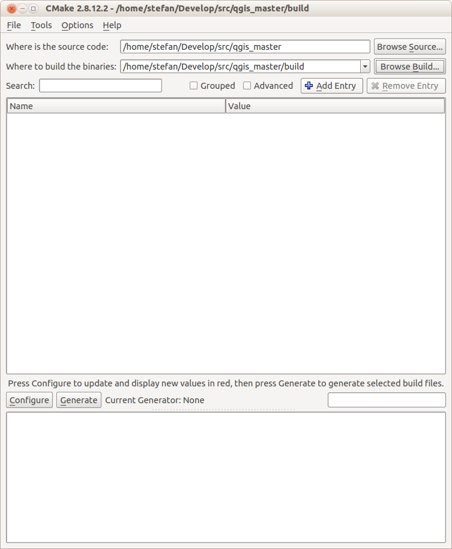
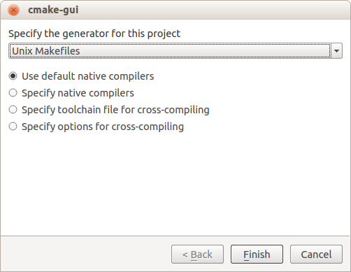
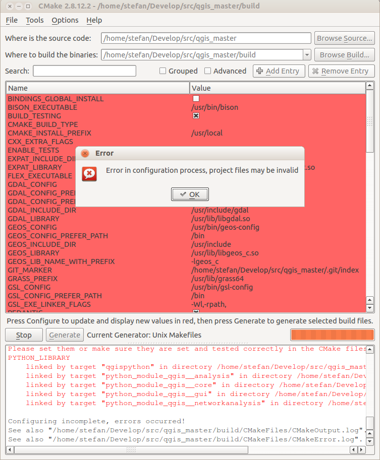
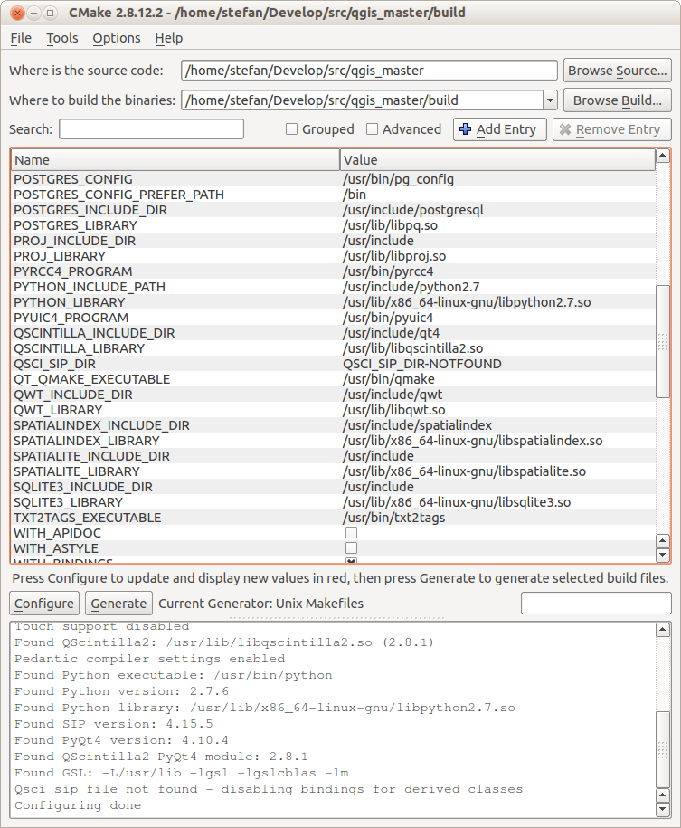

Installation
============

Komponenten
-----------
Es werden verschiedene Software(-komponenten) benötigt:

* QGIS: Frontend für Benutzer zum Durchführen der Prüfungen.
* VeriSO: QGIS-Plugin. Steuert die Import- und Exportprozesse und führt den Verifikationr durch die Prüfungen.
* PostgreSQL/Postgis: Datenhaltung und Geoprozesse.
* VeriSO-Java: Importroutine (Interlis -> PostgreSQL)
* x2go: Terminalserver-Lösung
* Qt Linguist: Übersetzungshilfe für Qt-Programme

.. note:: Nachfolgend wird der Installationsprozess für Ubuntu 14.04 64bit erläutert. Es handelt sich dabei um eine (1) Möglichkeit. Die Pogrammversionen entsprechen den in den verschiedenen Repositories vorhandenen Versionen vom August 2014.

Ubuntugis Repository
--------------------
Das Ubuntugis Repository stellt aktuelle(re) Versionen von GIS-Komponenten (wie z.B. GDAL oder GEOS) für Ubuntu zur Verfügung. Dazu sind folgende zwei Zeilen in der Datei ``/etc/apt/sources.list`` hinzufügen:

::

    deb http://ppa.launchpad.net/ubuntugis/ubuntugis-unstable/ubuntu trusty main
    deb-src http://ppa.launchpad.net/ubuntugis/ubuntugis-unstable/ubuntu trusty main

Anschliessend muss noch der Schlüssel hinzugefügt werden:

::
   
    sudo apt-key adv --keyserver keyserver.ubuntu.com --recv-keys 314DF160
    sudo apt-get update

Falls der Server hinter einem Proxy steht, kann mit folgendem Befehl der Port 80 verwendet werden:

::
    
    sudo apt-key adv --keyserver hkp://keyserver.ubuntu.com:80/ --recv-key 314DF160
    sudo apt-get update

PostgreSQL 9.3 / PostGIS 2.1
----------------------------
::

    sudo apt-get install postgresql
    sudo apt-get install postgis
    sudo apt-get install postgresql-9.3-postgis-scripts
    sudo apt-get install pgadmin3

QGIS
----
Zur Zeit (August 2014) läuft VeriSO mit QGIS 2.4 und QGIS master. Wird VeriSO als Dienst angeboten und läuft aus diesem Grund auf einem Server, wird empfohlen QGIS selber zu kompilieren. Hauptvorteil ist vor allem die Möglichkeit verschiedene QGIS-Versionen parallel installiert zu haben.

Im folgenden wird das Ganze mit QGIS master durchgespielt. Der Ablauf ist aber identisch mit QGIS 2.4. Die Quellen von QGIS 2.4 können `hier <http://qgis.org/downloads/qgis-2.4.0.tar.bz2>`_ heruntergeladen werden.

.. note:: Treten Fehlermeldungen auf, bitte zuerst immer die Permissions kontrollieren. Wird QGIS nicht im Home-Verzeichnis kompiliert und installiert, muss der User (der die Software kompiliert und installiert) entweder die benötigten Rechte haben oder die Aktionen müssen als *root* resp. *sudo* ausgeführt werden.

Abhängigkeiten
**************
::
   
    sudo apt-get build-dep qgis
    sudo apt-get install cmake-curses-gui cmake-qt-gui gdal-bin python-gdal python-qscintilla2 libqscintilla2-dev

Quellen herunterladen
*********************
Die Quellen werden in das Verzeichnis ``/usr/local/src/qgis/qgis_master/`` heruntergeladen:

::

    git clone git://github.com/qgis/QGIS.git /usr/local/src/qgis/qgis_master

Kompilieren
***********
Im Quellverzeichnis ein Verzeichnis ``build/`` erstellen. In der Konsole in dieses Verzeichnis wechseln und den Befehl ``cmake-gui`` ausführen. Beim ersten Mal erscheint ein leeres Fenster:

   cmake-gui beim erstmaligen Aufruf

In den ersten beiden Zeilen müssen die Verzeichnisse angepasst werden. In unserem Fall ``/usr/local/src/qgis/qgis_master/`` und ``/usr/local/src/qgis/qgis_master/build/``. Als nächste Muss der Knopf *Configure* gedrückt werden. Es erscheint beim ersten Mal folgendes Fenster:

Darauf achten, dass in der Combobox *Unix Makefiles* steht. Anschliessend *Finish* drücken. Es erscheinen viele Zeilen im Hauptfenster und eine Fehlermeldung:

   Fehlermeldungen

Die Fehlermeldung ist darauf zurückzuführen, dass die Python-Bibliothek nicht gefunden werden konnte. Diese muss beim Parameter *PYTHON_LIBRARY* manuell eingetragen werden:

   *PYTHON_LIBRARY* wird nicht gefunden und muss manuell ergänzt werden: ``/usr/lib/x86_64-linux-gnu/libpython2.7.so``

Ebenfalls manuell geändert resp. eingetragen werden, müssen folgende Parameter:

* *BUILD_TESTING*: ausschalten
* *CMAKE_BUILD_TYPE*: Release
* *CMAKE_INSTALL_PREFIX*: In dieses Verzeichnis wird QGIS installiert. Empfohlen wird: ``/usr/local/qgis/qgis_master/``. Dieses Verzeichnis muss vor dem Kompilieren angelegt werden.
* *ENABLE_TESTS*: ausschalten
* *WITH_GRASS*: ausschalten

Läuft *Configure* ohne Fehler durch, kann der Knopf *Generate* gedrückt werden. Anschliessen das Fenster schliessen. Mit folgendem Befehle wird QGIS kompiliert *und* installiert:

::

    sudo make -j4 install

QGIS Starter/Launcher
*********************
Um das selber kompilierte QGIS bequem zu starten wird ein Bash-Skript ``qgis_master.sh`` und ein Desktop-Launcher (für Unity und/oder Gnome Session Fallback) verwendet. Im Bash-Skript wird der korrekte *LD_LIBRARY_PATH* gesetzt:

.. code-block:: bash

    #!/bin/bash
    export LD_LIBRARY_PATH=$LD_LIBRARY_PATH:/usr/local/qgis/qgis_master/lib
    /usr/local/qgis/qgis_master/bin/qgis

Das Bash-Skript ausführbar machen (``chmod +rx qgis_master.sh``) und z.B. im Verzeichnis ``/usr/local/qgis/`` speichern.

Für das Desktop-Icon resp. Launcher eine Datei ``qgis_master.desktop`` erzeugen und ausführbar machen. Der Inhalt der Datei ist wie folgt:

.. code-block:: bash

    [Desktop Entry]
    Version=1.0
    Name=QGIS Master
    Comment=QGIS Master
    Exec=/usr/local/qgis/qgis_master.sh
    Terminal=false
    X-MultipleArgs=false
    Type=Application
    Icon=/usr/local/qgis/qgis_master/share/qgis/images/icons/qgis-icon-60x60.png
    StartupNotify=true

    Name[en_US]=qgis_master

Die Datei kann nun mit der Maus auf den Desktop verschoben werden.

VeriSO
------
Abhängigkeiten
**************
Es müssen verschiedene Qt-Pakete installiert werden und zusätzliche Pythonmodule.

::

    sudo apt-get install python-qt4-sql
    sudo apt-get install libqt4-sql-psql

Diese Pakete installieren die notwendigen Datenbank-Treiber (für QGIS-Plugins).

Ein Python-Modul (ebenfalls ein Datenbanktreiber) kann wie folgt installiert werden:

::

    sudo apt-get install python-psycopg2

Zu guter Letzt muss noch ein Python-Modul zum Schreiben von Excel-Dateien installiert werden. Heruntergeladen werden kann es `hier <https://pypi.python.org/pypi/xlwt>`_. Die Datei entpacken, in das erzeugte Verzeichnis wechseln und folgender Befehl aussführen:

::

    sudo python setup.py install

Plugin
******
Das Plugin mit git in das jeweilige QGIS-Plugin-Verzeichnis des Users clonen (oder in das globale Python-Plugin-Verzeichnis):

::

    git clone https://edigonzales@bitbucket.org/edigonzales/qgis_veriso.git /home/stefan/.qgis2/python/plugins/veriso

Falls zuvor noch keine Plugins heruntergeladen wurden, muss das Verzeichnis ``python/plugins/`` manuell angelegt werden.

VeriSO-Java
-----------
Abhängigkeiten
**************
Es muss mindestens Java 7 installiert sein:

::

    sudo apt-get install openjdk-7-jdk

Zum Erzeugen der ausführbaren Jar-Datei, muss zudem *Maven* installiert sein. *Maven 3.2.2* kann `hier <http://mirror.switch.ch/mirror/apache/dist/maven/maven-3/3.2.2/binaries/apache-maven-3.2.2-bin.zip>`_ heruntergeladen werden. Die Datei auspacken und an einen gewünschten Ort kopieren. Der Inhalt des ``bin/``-Verzeichnisses ausführbar machen.

In der Datei ``.bashrc`` das ``bin/``-Verzeichnis der Umgebungsvariable *PATH* hinzufügen:

::

    export PATH=$PATH:/home/stefan/Apps/apache-maven-3.2.2/bin

Und anschliessend:

::

    source .bashrc

Überprüfen, ob *Maven* gefunden wird:

::

    mvn -v

Output sollte ähnlich wie folgt aussehen:

::

    Apache Maven 3.2.2 (45f7c06d68e745d05611f7fd14efb6594181933e; 2014-06-17T15:51:42+02:00)
    Maven home: /home/stefan/Apps/apache-maven-3.2.2
    Java version: 1.7.0_65, vendor: Oracle Corporation
    Java home: /usr/lib/jvm/java-7-openjdk-amd64/jre
    Default locale: en_US, platform encoding: UTF-8
    OS name: "linux", version: "3.13.0-32-generic", arch: "amd64", family: "unix"

Importroutine
*************
Nun kann das eigentliche Programm, die Interlis-Importroutine, mit *git* gecloned werden:

::

    git clone https://edigonzales@bitbucket.org/edigonzales/java_veriso.git /home/stefan/Develop/src/java_veriso

Folgender Befehl im Verzeichnis ``/home/stefan/Develop/src/java_veriso`` erzeugt eine ausführbare Jar-Datei:

::

    mvn clean install

Im Verzeichnis ``/home/stefan/Develop/src/java_veriso/target/`` gibt es jetzt die Datei ``veriso-1.0-SNAPSHOT.jar``. Diese kann an einen beliebigen Ort kopiert werden.

x2go
----
Baikal (LTS)
************
Das x2go-Baikal Repository hinzufügen und x2go Server installieren:

::

    sudo add-apt-repository ppa:x2go/baikal
    sudo apt-get update 
    sudo apt-get install x2goserver x2goserver-xsession

Aktuelle Version
****************
Für die aktuelle(re) x2go-Version muss ein anderes Repository hinzugefügt werden:

::

    sudo add-apt-repository ppa:x2go/stable
    sudo apt-get update 
    sudo apt-get install x2goserver x2goserver-xsession

Qt-Linguist
-----------
Mit der Software Qt-Linguist können GUI-Elemente des Plugins einfach internationalisiert werden (Vorgehen siehe ....):

::

    sudo apt-get install qt4-dev-tools

Sqliteman
---------
Sqliteman dient der Entwicklung und Administration von Sqlite-Datenbanken. Eine solche wird verwendet um nach dem Import der Interlis-Datei neue Tabellen und/oder View in der PostgreSQL-Datenbank zu erzeugen (mehr dazu im Kapitel :ref:`postprocessing`). Installiert wird Sqliteman mit folgendem Befehl:

::

    sudo apt-get install sqliteman

Es gibt noch viele andere, ähnliche Programme (z.B. auch ein Firefox Plugin), die dem gleichen Zweck dienen.

Optional
--------
Qt-Config
*********
Mit Qt-Config lässt sich das Aussehen von Qt-Anwendungen steuern:

::

    sudo apt-get install qt4-qtconfig

Qt-Designer
***********
Will man die GUI-Fenster selber verändern, empfiehlt es sich den Qt-Designer zu installieren:

::

    sudo apt-get install qt4-designer

Fonts
*****
Zusätzliche Schriften (TTF etc.) am besten global installieren. Die Fonts (z.B. `Cadastra <http://www.cadastre.ch/internet/cadastre/de/home/products/cadastra_map.parsysrelated1.80905.downloadList.61511.DownloadFile.tmp/cadastradefrit.zip>`_)  in das Verzeichnis ``/usr/share/fonts/truetype/cadastra/`` kopieren und folgenden Befehl ausführen:

::

    sudo fc-cache -v -f 

