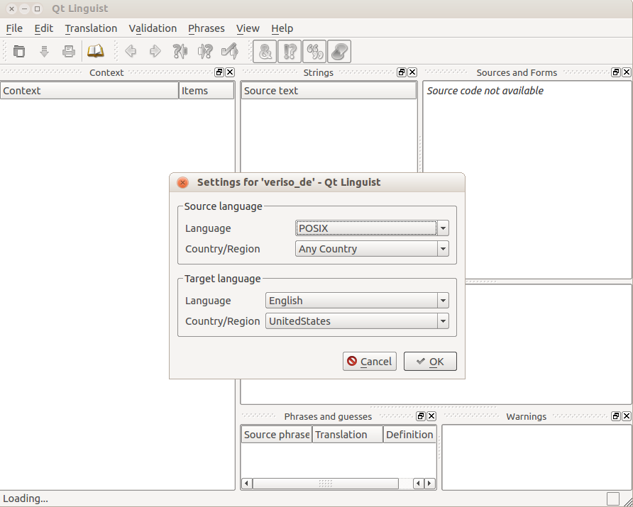
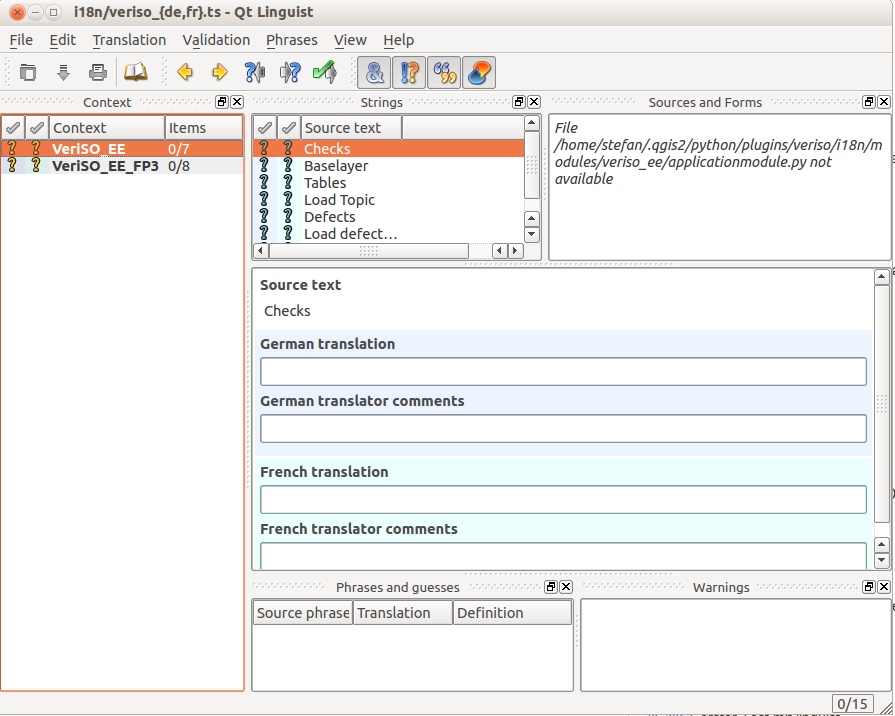

.. _mehrsprachigkeit:

Mehrsprachigkeit
================
Es gibt - grob eingeteilt - einen *statischen* und einen *dynamischen* Teil, der übersetzt werden muss. Der statische Teil kann mit Qt-Bordmitteln durchgeführt werden. Er beinhaltet alle Texte der GUI-Elemente, die **nicht** erst während der Laufzeit entstehen, also z.B. die Topmenueinträge ("Projects", "File", etc.). 

Der dynamische Teil beinhaltet also alles was erst zur Laufzeit entsteht wie z.B. Menueinträge zu den Checks, Layernamen in der Legende von QGIS etc. Dieser Teil ist VeriSO-spezifisch und wurde bereits im Kapitel :ref:`complexchecks` erläutert. 

Statischer Teil
---------------
Alles was übersetzt werden soll muss im Quellcode gekennzeicht werden. Dies geschieht teilweise automatisch (bei GUI-Elementen) oder muss selbst vorgenommen werden. In den ComplexChecks wurde das mit der Methoden *_translate()* gemacht. 

Im Pluginwurzelverzeichnis (z.B. ``/home/stefan/.qgis2/python/plugins/veriso/``) muss eine Datei ``veriso.pro`` erstellt werden:

::
 
 SOURCES = veriso.py \
 modules/veriso_ee/applicationmodule.py \
 modules/veriso_ee/complexchecks/fp3.py

 TRANSLATIONS = i18n/veriso_de.ts \
 i18n/veriso_fr.ts

Bei *SOURCES* müssen sämtliche Pythondateien angegeben werden, in denen Texte zu übersetzen sind. Bei *TRANSLATIONS* stehen die Übersetzungdateien, die aus dem Quellcode erstellt werden. Diese werden im nächsten Schritt erstellt und im Verzeichnis ``i18n/`` gespeichert. Für die italienische Übersetzung muss man eine weitere Zeile hinzufügen: *i18n/veriso_it.ts*.

Mit dem Aufruf:

.. code-block:: bash

    pylupdate4 veriso.pro:

im Pluginwurzelverzeichnis werden die beiden Dateien ``veriso_de.ts`` und  ``veriso_fr.ts`` im Verzeichnis  ``i18n/`` erstellt. Dabei durchsucht die Software alle zu übersetzenden Texte in den eingetragen Pythondateien und schreibt sie in die .ts-Dateien.

Anschliessend kann die Übersetzungs(hilfs)software gestartet werden:

.. code-block:: bash

    linguist i18n/veriso_de.ts i18n/veriso_fr.ts
    
Es können beliebig viele .ts-Dateien angegeben werden. Beim ersten Start sollte folgendes Fenster erscheinen:

   Linguist #1

Bei *Souce language* kann POSIX / Any Country gewählt werden. Bei der *Target language* die jeweils passende (siehe Titel im kleinen Fenster), dh. German / Any Country und French / Any Country. Nach dem Setzen der Sprache sollte der Inhalt des Hauptfenster so aussehen:

   Linguist #2
   
Im linken Teil stehen die verschiedenen "Übersetzungsgruppen". Für jeden ComplexCheck sollte eine neue Gruppe erstellt werden (siehe :ref:`complexchecks`). Im oberen mittleren Bereich stehen die zu übersetzenden Texte. In der Mitte die Eingabemaske für die Übersetzung. Die "... translator comments" können leer bleiben. Mit den gelben Pfeilen kann der nächste Text angewählt werden. Wurde eine Übersetzungsgruppe übersetzt muss mit der Maus die nächste angewählt werden. 

Umlaute werden unter Umständen im oberen mittleren Bereich nicht korrekt dargestellt. Dies hat aber keinen Einfluss auf die korrekte Darstellung in QGIS.

Werden z.B. sämtliche Layernamen im Quellcode in deutsch geschrieben, muss nicht zwangsweise eine deutscher Übersetzung gemacht werden.

Mit *File* - *Release all* können nach dem Speichern (*Save all* / Ctrl+S) die binären Dateien mit den Übersetzungen erstellt werden. Diese werden dann von QGIS erkannt und beim Wechseln der Sprach in QGIS sollten ebenfalls die statischen Elemente des Plugins übersetzt werden.

